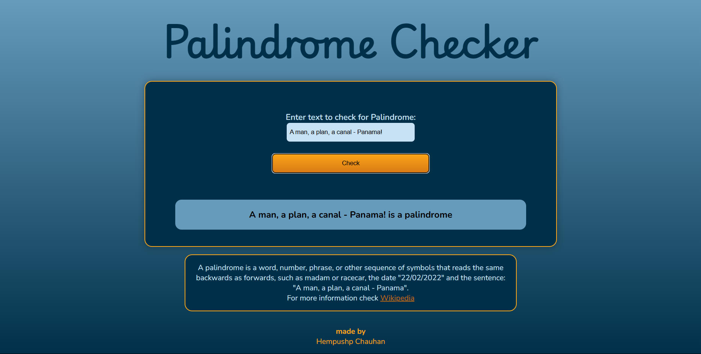

# Palindrome Checker

A sleek and responsive web application to check whether a given string is a palindrome. It intelligently ignores punctuation, spaces, and capitalization, giving you accurate results with a clean and modern interface.

## Features

- Real-time palindrome checking  
- Cleans input by removing punctuation, spaces, and casing  
- Aesthetic and responsive design  
- Mobile-friendly layout

## How It Works

Just type any sentence, phrase, or word into the input field and hit "Check". The app will:
1. Format the input (lowercase, remove special characters and spaces)
2. Reverse the cleaned string
3. Compare and display whether it's a palindrome

## Tech Stack

- **HTML5** — Structure  
- **CSS3** — Styling and layout  
- **JavaScript (Vanilla)** — Logic and DOM interaction

## File Structure

```
palindrome-checker/
├── index.html      # Main web page
├── style.css       # Stylesheet for layout and design
└── script.js       # JavaScript for palindrome logic
```

## Example



**Input:**  
A man, a plan, a canal - Panama!

**Output:**  
Cleaned input: amanaplanacanalpanama  
A man, a plan, a canal - Panama! is a palindrome.

## Getting Started

No setup required!

1. Clone the repository or [download ZIP](https://github.com/yourusername/palindrome-checker)
2. Open `index.html` in your browser
3. Start checking palindromes!

## What is a Palindrome?

A palindrome is a word, phrase, or sequence that reads the same backward as forward, ignoring punctuation, spaces, and letter casing.  
Examples:  
- madam  
- racecar  
- Was it a car or a cat I saw?

Made with ❤️ by [Kurogami](https://github.com/kurogamidesuu)